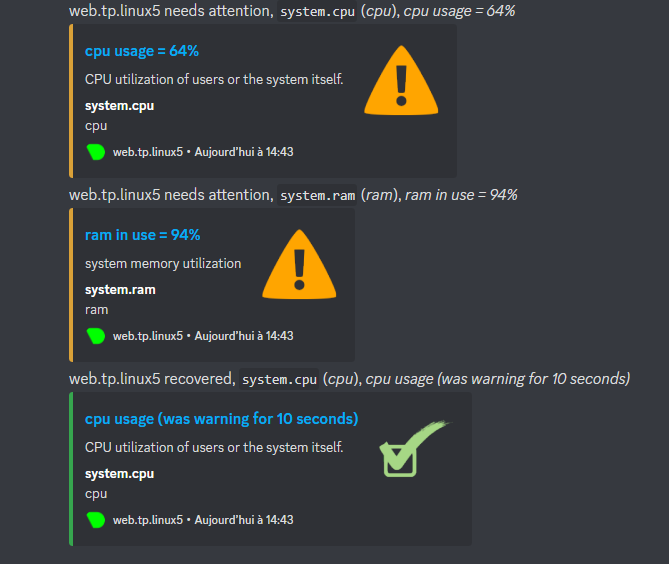

# TP6 : Travail autour de la solution NextCloud

# 0. Setup

## Sommaire

- [TP6 : Travail autour de la solution NextCloud](#tp6--travail-autour-de-la-solution-nextcloud)
- [0. Setup](#0-setup)
  - [Sommaire](#sommaire)
  - [Checklist](#checklist)
  - [Le lab](#le-lab)
- [I. Here we go](#i-here-we-go)

**Les éléments de la 📝checklist📝 sont STRICTEMENT OBLIGATOIRES à réaliser mais ne doivent PAS figurer dans le rendu.**

## Le lab

# I. Here we go

- [Module 1 : Reverse Proxy](./1-reverse-proxy/README.md)
- [Module 2 : Sauvegarde du système de fichiers](./2-backup/README.md)
- [Module 3 : Fail2Ban](3-fail2ban/README.md)
- [Module 4 : Monitoring](4-monitoring/README.md)


# Module 1 : Reverse Proxy

## Sommaire

- [Module 1 : Reverse Proxy](#module-1--reverse-proxy)
  - [Sommaire](#sommaire)
- [I. Setup](#i-setup)
- [II. HTTPS](#ii-https)

# I. Setup

🖥️ **VM `proxy.tp6.linux`**

**N'oubliez pas de dérouler la [📝**checklist**📝](../../2/README.md#checklist).**

➜ **On utilisera NGINX comme reverse proxy**

```
[mat@proxy ~]$ sudo dnf install nginx -y
[mat@proxy ~]$ sudo systemctl start nginx
[sudo] password for mat:
[mat@proxy ~]$ sudo systemctl enable nginx
Created symlink /etc/systemd/system/multi-user.target.wants/nginx.service → /usr/lib/systemd/system/nginx.service.
[mat@proxy ~]$ sudo ss -alnpt | grep nginx
LISTEN 0      511          0.0.0.0:80        0.0.0.0:*    users:(("nginx",pid=1466,fd=6),("nginx",pid=1465,fd=6),("nginx",pid=1464,fd=6),("nginx",pid=1463,fd=6))
LISTEN 0      511             [::]:80           [::]:*    users:(("nginx",pid=1466,fd=7),("nginx",pid=1465,fd=7),("nginx",pid=1464,fd=7),("nginx",pid=1463,fd=7))
[mat@proxy ~]$ ps -ef | grep nginx
root        1463       1  0 14:53 ?        00:00:00 nginx: master process /usr/sbin/nginx
nginx       1464    1463  0 14:53 ?        00:00:00 nginx: worker process
nginx       1465    1463  0 14:53 ?        00:00:00 nginx: worker process
nginx       1466    1463  0 14:53 ?        00:00:00 nginx: worker process
mat         1497    1229  0 14:59 pts/0    00:00:00 grep --color=auto nginx
[mat@proxy ~]$ sudo firewall-cmd --add-port=80/tcp --permanent
[sudo] password for mat:
success
[mat@proxy ~]$ sudo firewall-cmd --reload
success
```

```
matsu@Matsuel MINGW64 ~
$ curl 10.105.1.13:80 | grep nginx
  % Total    % Received % Xferd  Average Speed   Time    Time     Time  Current
                                 Dload  Upload   Total   Spent    Left  Speed
100  7620  100  7620    0     0  3922k      0 --:--:-- --:--:-- --:--:-- 7441k
        <a href="https://nginx.org">Nginx</strong></a>:
        in <code>/etc/nginx/nginx.conf</code>.</p>
      <a href="https://nginx.org">NGINX&trade;</a> is a registered trademark of <a href="https://">F5 Networks, Inc.</a>.


```

➜ **Configurer NGINX**

```
[mat@proxy ~]$ sudo nano /etc/nginx/conf.d/reverse.conf

server {
    # On indique le nom que client va saisir pour accéder au service
    # Pas d'erreur ici, c'est bien le nom de web, et pas de proxy qu'on veu>    server_name web.tp6.linux;

    # Port d'écoute de NGINX
    listen 80;

    location / {
        # On définit des headers HTTP pour que le proxying se passe bien
        proxy_set_header  Host $host;
        proxy_set_header  X-Real-IP $remote_addr;
        proxy_set_header  X-Forwarded-Proto https;
        proxy_set_header  X-Forwarded-Host $remote_addr;
        proxy_set_header  X-Forwarded-For $proxy_add_x_forwarded_for;

        # On définit la cible du proxying
        proxy_pass http://10.105.1.11:80;
    }

    # Deux sections location recommandés par la doc NextCloud
    location /.well-known/carddav {
      return 301 $scheme://$host/remote.php/dav;
    }

    location /.well-known/caldav {
      return 301 $scheme://$host/remote.php/dav;
    }
}
```

```
[mat@web ~]$ sudo nano /var/www/tp5_nextcloud/config/config.php

<?php
$CONFIG = array (
  'instanceid' => 'ocrjlxlswx8q',
  'passwordsalt' => 'pMoJVR1CjMJdVVdVGEekQFmA3sxHdH',
  'secret' => '+JSoVPx6Uv2lIp/EzYzTGNngobA0Q/Q2/WIdB2hQftXz0bU/',
  'trusted_domains' =>
  array (
          0 => 'web.tp5.linux',
          1 => '10.105.1.11',
  ),
  'datadirectory' => '/var/www/tp5_nextcloud/data',
  'dbtype' => 'mysql',
  'version' => '25.0.0.15',
  'overwrite.cli.url' => 'http://web.tp5.linux',
  'dbname' => 'nextcloud',
  'dbhost' => '10.105.1.12:3306',
  'dbport' => '',
  'dbtableprefix' => 'oc_',
  'mysql.utf8mb4' => true,
  'dbuser' => 'nextcloud',
  'dbpassword' => 'pewpewpew',
  'installed' => true,
);


[mat@proxy ~]$ sudo nano /etc/nginx/conf.d/reverse.conf

[mat@proxy ~]$ sudo cat /etc/nginx/conf.d/reverse.conf
server {
    # On indique le nom que client va saisir pour accéder au service
    # Pas d'erreur ici, c'est bien le nom de web, et pas de proxy qu'on veut ici !
    server_name web.tp5.linux;

    # Port d'écoute de NGINX
    listen 80;

    location / {
        # On définit des headers HTTP pour que le proxying se passe bien
        proxy_set_header  Host $host;
        proxy_set_header  X-Real-IP $remote_addr;
        proxy_set_header  X-Forwarded-Proto https;
        proxy_set_header  X-Forwarded-Host $remote_addr;
        proxy_set_header  X-Forwarded-For $proxy_add_x_forwarded_for;

        # On définit la cible du proxying
        proxy_pass http://10.105.1.11;
    }

    # Deux sections location recommandés par la doc NextCloud
    location /.well-known/carddav {
      return 301 $scheme://$host/remote.php/dav;
    }

    location /.well-known/caldav {
      return 301 $scheme://$host/remote.php/dav;
    }
}
```


➜ **Modifier votre fichier `hosts` de VOTRE PC**

# localhost name resolution is handled within DNS itself.
#	127.0.0.1       localhost
#	::1             localhost
     10.105.1.13     web.tp5.linux

➜ **Faites en sorte de**

```
[mat@web ~]$ sudo firewall-cmd --permanent --zone=public --add-rich-rule='rule family="ipv4" source address="10.105.1.13" accept'
[sudo] password for mat:
success
[mat@web ~]$ sudo firewall-cmd --permanent --zone=public --add-rich-rule='rule family="ipv4" source not address="10.105.1.13" drop'
success
[mat@web ~]$ sudo firewall-cmd --reload
success
```
➜ **Une fois que c'est en place**

```
PS C:\Users\matsu> ping 10.105.1.13

Envoi d’une requête 'Ping'  10.105.1.13 avec 32 octets de données :
Réponse de 10.105.1.13 : octets=32 temps<1ms TTL=64
Réponse de 10.105.1.13 : octets=32 temps=1 ms TTL=64
Réponse de 10.105.1.13 : octets=32 temps<1ms TTL=64
Réponse de 10.105.1.13 : octets=32 temps<1ms TTL=64

Statistiques Ping pour 10.105.1.13:
    Paquets : envoyés = 4, reçus = 4, perdus = 0 (perte 0%),
Durée approximative des boucles en millisecondes :
    Minimum = 0ms, Maximum = 1ms, Moyenne = 0ms
PS C:\Users\matsu> ping 10.105.1.11

Envoi d’une requête 'Ping'  10.105.1.11 avec 32 octets de données :
Délai d’attente de la demande dépassé.
Délai d’attente de la demande dépassé.
Délai d’attente de la demande dépassé.
Délai d’attente de la demande dépassé.

Statistiques Ping pour 10.105.1.11:
    Paquets : envoyés = 4, reçus = 0, perdus = 4 (perte 100%),
```


# II. HTTPS

```
[mat@proxy ~]$ sudo openssl req -x509 -nodes -days 365 -newkey rsa:2048 -keyout /etc/ssl/private/nginx.key -out /etc/ssl/certs/certificate
#On génère le certificat et la clé de chiffrement.
-----
You are about to be asked to enter information that will be incorporated
into your certificate request.
What you are about to enter is what is called a Distinguished Name or a DN.
There are quite a few fields but you can leave some blank
For some fields there will be a default value,
If you enter '.', the field will be left blank.
-----
Country Name (2 letter code) [XX]:
State or Province Name (full name) []:
Locality Name (eg, city) [Default City]:
Organization Name (eg, company) [Default Company Ltd]:
Organizational Unit Name (eg, section) []:
Common Name (eg, your name or your server's hostname) []:
Email Address []:


[mat@proxy ~]$ sudo nano /etc/nginx/conf.d/reverse.conf
server {
    # On indique le nom que client va saisir pour accéder au service
    # Pas d'erreur ici, c'est bien le nom de web, et pas de proxy qu'on veut ici !
    server_name web.tp5.linux;

    # Port d'écoute de NGINX
    listen 80;

    location / {
        # On définit des headers HTTP pour que le proxying se passe bien
        proxy_set_header  Host $host;
        proxy_set_header  X-Real-IP $remote_addr;
        proxy_set_header  X-Forwarded-Proto https;
        proxy_set_header  X-Forwarded-Host $remote_addr;
        proxy_set_header  X-Forwarded-For $proxy_add_x_forwarded_for;

        # On définit la cible du proxying
        proxy_pass http://10.105.1.11;
    }

    # Deux sections location recommandés par la doc NextCloud
    location /.well-known/carddav {
      return 301 $scheme://$host/remote.php/dav;
    }

    location /.well-known/caldav {
      return 301 $scheme://$host/remote.php/dav;
    }
    listen 443 http2 ssl;
    listen [::]:443 http2 ssl;
    ssl_certificate /etc/ssl/certs/certificate;
    ssl_certificate_key /etc/ssl/private/nginx.key;
}
```

#Ensuite on ouvre le port 443 sur le firewall et on relance nginx:

```
[mat@proxy ~]$ sudo firewall-cmd --add-port=443/tcp --permanent
success
[mat@proxy ~]$ sudo firewall-cmd --reload
success
[mat@proxy ~]$ sudo systemctl restart nginx
```


# Module 2 : Sauvegarde du système de fichiers


## Sommaire

## I. Script de backup


### 1. Ecriture du script

🌞 **Ecrire le script `bash`**

[Script](./src/tp6_backup.sh)

```
[mat@web ~]$ cat /srv/tp6_backup.sh
#!/bin/bash

#On récupère la date
date=`date +"%y%m%d%H%M%S"`

#On définit le nom du fichier
filename=nextcloud-backup_$date.zip

#Activer le mode maintenance de nexctloud
sed -i "s/'maintenance' => false,/'maintenance' => true,/" /var/www/tp5_nextcloud/config/config.php

#Archivez le dossier nextcloud
cd /srv/backup
zip -r $filename /var/www/tp5_nextcloud > /dev/null

#Désactiver le mode maintenance de nextcloud
sed -i "s/'maintenance' => true,/'maintenance' => false,/" /var/www/tp5_nextcloud/config/config.php

echo "Zip folder available /srv/backup/$filename"


#Ce script permet de créer une archive de toutes les données de nextcloud
#que l'on pourra réutiliser si jamais le serveur web ne fonctionnait plus
#On active le mode maintenance sur nextcloud puis on archive le dossier
#nextcloud puis on désactive le mode maintenance
#Scriptécrit le 10/01/2023 par Mathéo Lang
```

➜ **Environnement d'exécution du script**

```
[mat@web ~]$ sudo useradd -m -d /srv/backup/ -s /usr/sbin/nologin backup
useradd: warning: the home directory /srv/backup/ already exists.
useradd: Not copying any file from skel directory into it.
```

```bash
$ sudo -u backup /srv/tp6_backup.sh
```

### 3. Service et timer

🌞 **Créez un *service*** système qui lance le script

[Backup.service](./src/backup.service)

```
[mat@web ~]$ cat /etc/systemd/system/backup.service
[Unit]
Description=Ce petit service permet de faire des backup du dossier nextcloud

[Service]
Type=oneshot
ExecStart=/srv/tp6_backup.sh
User=backup
```

```
[mat@web ~]$ sudo systemctl status backup
○ backup.service - Ce petit service permet de faire des backup du dossier n>
     Loaded: loaded (/etc/systemd/system/backup.service; static)
     Active: inactive (dead)

Jan 10 10:44:53 web.tp.linux5 systemd[1]: backup.service: Deactivated succe>
Jan 10 10:44:53 web.tp.linux5 systemd[1]: Finished Ce petit service permet >


[mat@web ~]$ sudo systemctl start backup
```

🌞 **Créez un *timer*** système qui lance le *service* à intervalles 

```
[mat@web ~]$ sudo nano /etc/systemd/system/backup.timer

[mat@web ~]$ sudo cat /etc/systemd/system/backup.timer
[Unit]
Description=Run service Backup

[Timer]
OnCalendar=*-*-* 1:00:00

[Install]
WantedBy=timers.target

```

🌞 Activez l'utilisation du *timer*

- vous vous servirez des commandes suivantes :

```
[mat@web ~]$ sudo systemctl daemon-reload
[mat@web ~]$ sudo systemctl start backup.timer
[mat@web ~]$ sudo systemctl enable backup.timer
Created symlink /etc/systemd/system/timers.target.wants/backup.timer → /etc/systemd/system/backup.timer.
[mat@web ~]$ sudo systemctl status backup.timer
● backup.timer - Run service Backup
     Loaded: loaded (/etc/systemd/system/backup.timer; enabled; vendor pres>     Active: active (waiting) since Tue 2023-01-10 10:55:13 CET; 1min 18s a>      Until: Tue 2023-01-10 10:55:13 CET; 1min 18s ago
    Trigger: Wed 2023-01-11 00:10:00 CET; 13h left
   Triggers: ● backup.service

Jan 10 10:55:13 web.tp.linux5 systemd[1]: Started Run service Backup.
```

## II. NFS

### 1. Serveur NFS

🖥️ **VM `storage.tp6.linux`**

🌞 **Préparer un dossier à partager sur le réseau** (sur la machine `storage.tp6.linux`)

```
[mat@storage ~]$ sudo /srv/nfs_shares/
[mat@storage ~]$ sudo mkdir /srv/nfs_shares/web.tp6.linux/
[mat@storage ~]$ sudo chown nobody /srv/nfs_shares/
[sudo] password for mat:
[mat@storage ~]$ sudo chown nobody /srv/nfs_shares/web.tp6.linux/
```

🌞 **Installer le serveur NFS** (sur la machine `storage.tp6.linux`)

```
[mat@storage ~]$ sudo dnf install -y nfs-utils

[mat@storage ~]$ cat /etc/exports
/srv/nfs_shares/web.tp6.linux/ 10.105.1.11(rw,sync,no_subtree_check)


[mat@storage ~]$ sudo firewall-cmd --permanent --add-service=nfs
success
[mat@storage ~]$ sudo firewall-cmd --permanent --add-service=mountd
success
[mat@storage ~]$ sudo firewall-cmd --permanent --add-service=rpc-bind
success
[mat@storage ~]$ sudo firewall-cmd --reload
success
```

### 2. Client NFS

🌞 **Installer un client NFS sur `web.tp6.linux`**

```
[mat@web ~]$ sudo mount 10.105.1.14:/srv/nfs_shares/web.tp6.linux/ /srv/backup/
[mat@web ~]$ df -h
Filesystem                                 Size  Used Avail Use% Mounted on
devtmpfs                                   869M     0  869M   0% /dev
tmpfs                                      888M     0  888M   0% /dev/shm
tmpfs                                      355M  6.8M  349M   2% /run
/dev/mapper/rl-root                        6.2G  2.1G  4.2G  34% /
/dev/sda1                                 1014M  241M  774M  24% /boot
tmpfs                                      178M     0  178M   0% /run/user/1000
10.105.1.14:/srv/nfs_shares/web.tp6.linux  6.2G  1.2G  5.1G  18% /srv/backup
[mat@web ~]$ sudo touch /srv/backup/test.txt
[mat@web ~]$ sudo rm /srv/backup/test.txt
[mat@web ~]$ sudo touch /srv/backup/test.txt
[mat@web ~]$ sudo rm /srv/backup/test.txt
[mat@web ~]$ sudo nano /etc/fstab
[mat@web ~]$ sudo cat /etc/fstab | grep 10.105.1.14
10.105.1.14:/srv/nfs_shares/web.tp6.linux/ /srv/backup nfs auto,nofail,noatime,nolock,intr,tcp,actimeo=1800 0 0
```

🌞 **Tester la restauration des données** sinon ça sert à rien :)

- livrez-moi la suite de commande que vous utiliseriez pour restaurer les données dans une version antérieure


# Module 3 : Fail2Ban

```
[mat@db ~]$ sudo dnf install epel-release

[mat@db ~]$ sudo dnf install fail2ban fail2ban-firewalld

[mat@db ~]$ sudo systemctl start fail2ban
[mat@db ~]$ sudo systemctl enable fail2ban
Created symlink /etc/systemd/system/multi-user.target.wants/fail2ban.service → /usr/lib/systemd/system/fail2ban.service.

[mat@db ~]$ sudo systemctl status fail2ban | grep active
     Active: active (running) since Thu 2023-01-12 19:20:58 CET; 3min 52s ago


[mat@db ~]$ sudo cp /etc/fail2ban/jail.conf /etc/fail2ban/jail.local
[mat@db ~]$ sudo nano /etc/fail2ban/jail.local


```

🌞 Faites en sorte que :

```
[mat@db ~]$ sudo cat /etc/fail2ban/jail.local | grep maxretry
# A host is banned if it has generated "maxretry" during the last "findtime"
# "maxretry" is the number of failures before a host get banned.
maxretry = 3


[mat@db ~]$ sudo cat /etc/fail2ban/jail.local | grep bantime
bantime  = 1h

[mat@db ~]$ sudo cat /etc/fail2ban/jail.local | grep findtime
# A host is banned if it has generated "maxretry" during the last "findtime"
findtime  = 1m


[mat@db ~]$ sudo systemctl status fail2ban
● fail2ban.service - Fail2Ban Service
     Loaded: loaded (/usr/lib/systemd/system/fail2ban.service; enabled; vendor preset: disabled)
     Active: active (running) since Thu 2023-01-12 19:20:58 CET; 8min ago
       Docs: man:fail2ban(1)
    Process: 11209 ExecStartPre=/bin/mkdir -p /run/fail2ban (code=exited, status=0/SUCCESS)
   Main PID: 11210 (fail2ban-server)
      Tasks: 5 (limit: 11117)
     Memory: 14.7M
        CPU: 2.029s
     CGroup: /system.slice/fail2ban.service
             └─11210 /usr/bin/python3 -s /usr/bin/fail2ban-server -xf start

Jan 12 19:20:58 proxy.tp6.linux systemd[1]: Starting Fail2Ban Service...
Jan 12 19:20:58 proxy.tp6.linux systemd[1]: Started Fail2Ban Service.
Jan 12 19:20:58 proxy.tp6.linux fail2ban-server[11210]: 2023-01-12 19:20:58,793 fail2ban.configreader>
Jan 12 19:20:58 proxy.tp6.linux fail2ban-server[11210]: Server ready
```

```
[mat@web ~]$ ssh mat@10.105.1.12
mat@10.105.1.12's password:
Permission denied, please try again.
mat@10.105.1.12's password:
Permission denied, please try again.
mat@10.105.1.12's password:
mat@10.105.1.12: Permission denied (publickey,gssapi-keyex,gssapi-with-mic,password).
[mat@web ~]$ ssh mat@10.105.1.12
ssh: connect to host 10.105.1.12 port 22: Connection refused
```

```
[mat@db ~]$ sudo fail2ban-client status sshd | grep Banned
   `- Banned IP list:   10.105.1.11
```

```
[mat@db ~]$ sudo firewall-cmd --list-all | grep rule
  rich rules:
        rule family="ipv4" source address="10.105.1.11" port port="ssh" protocol="tcp" reject type="icmp-port-unreachable"
```

```
[mat@db ~]$ sudo fail2ban-client unban 10.105.1.11
1
```


# Module 4 : Monitoring

🌞 **Installer Netdata**

```
[mat@web ~]$ sudo dnf install epel-release -y

[mat@web ~]$ wget -O /tmp/netdata-kickstart.sh https://my-netdata.io/kickstart.sh && sh /tmp/netdata-kickstart.sh

[mat@web ~]$ sudo systemctl start netdata
[mat@web ~]$ sudo systemctl enable netdata
[mat@web ~]$ sudo systemctl status netdata | grep active
     Active: active (running) since Thu 2023-01-12 21:59:46 CET; 36s ago
[mat@web ~]$ sudo firewall-cmd --permanent --add-port=19999/tcp
success
[mat@web ~]$ sudo firewall-cmd --reload
success

```


🌞 **Une fois Netdata installé et fonctionnel, déterminer :**

```
[mat@web ~]$ ps -ef | grep netdata | head -n5 | tail -n-1
netdata     2760       1  3 22:02 ?        00:00:10 /usr/sbin/netdata -P /run/netdata/netdata.pid -D

#L'utilisateur sous lequel tourne netdata est netdata.

[mat@web ~]$ sudo ss -ltpnu | grep netdata
udp   UNCONN 0      0          127.0.0.1:8125       0.0.0.0:*    users:(("netdata",pid=2760,fd=43))

udp   UNCONN 0      0              [::1]:8125          [::]:*    users:(("netdata",pid=2760,fd=42))

tcp   LISTEN 0      4096       127.0.0.1:8125       0.0.0.0:*    users:(("netdata",pid=2760,fd=49))

tcp   LISTEN 0      4096         0.0.0.0:19999      0.0.0.0:*    users:(("netdata",pid=2760,fd=6))

tcp   LISTEN 0      4096           [::1]:8125          [::]:*    users:(("netdata",pid=2760,fd=47))

tcp   LISTEN 0      4096            [::]:19999         [::]:*    users:(("netdata",pid=2760,fd=7))

#Netdata tourne sous les ports 8125 et 19999
```

```
[mat@web ~]$ sudo cat /var/log/netdata/access.log
#Pour consulter les logs de netdata.
```

🌞 **Configurer Netdata pour qu'il vous envoie des alertes** 

```
Configuration alerte CPU:


[mat@web ~]$ sudo nano /etc/netdata/health.d/cpu.conf
alarm: cpu_usage
on: system.cpu
lookup: average -3s percentage foreach user ,system
units: %
every: 10s
warn: $this > 50
crit: $this > 80
info: CPU utilization of users or the system itself.


[mat@web ~]$ sudo nano /etc/netdata/health.d/ram-usage.conf
Alerte RAM:


 alarm: ram_usage
    on: system.ram
lookup: average -1m percentage of used
 units: %
 every: 1m
  warn: $this > 80
  crit: $this > 90
  info: The percentage of RAM being used by the system.


Configuration des alertes pour les envoyer sur discord:

[mat@web ~]$ sudo cat /etc/netdata/health_alarm_notify.conf | tail -n 7
# https://support.discordapp.com/hc/en-us/articles/228383668-Intro-to-Webhooks
DISCORD_WEBHOOK_URL="https://discord.com/api/webhooks/1063204446164754502/FCD64L8Dzcy5WzajDeLc1UyILQ_IXHl-7nRWlHNYKVu4IZHjXT9khWozqSyEMIENsej_"

# if a role's recipients are not configured, a notification will be send to
# this discord channel (empty = do not send a notification for unconfigured
# roles):
DEFAULT_RECIPIENT_DISCORD="tp6"
```

🌞 **Vérifier que les alertes fonctionnent**

```
[mat@web ~]$ sudo dnf install epel-release
[mat@web ~]$ sudo dnf install stress
```

```
Test stress:

[mat@web ~]$ sudo stress --cpu 8 --vm 2 --vm-bytes 2048M --timeout 10s
stress: info: [2040] dispatching hogs: 8 cpu, 0 io, 2 vm, 0 hdd
stress: FAIL: [2040] (415) <-- worker 2042 got signal 9
stress: WARN: [2040] (417) now reaping child worker processes
stress: FAIL: [2040] (421) kill error: No such process
stress: FAIL: [2040] (451) failed run completed in 11s
```

